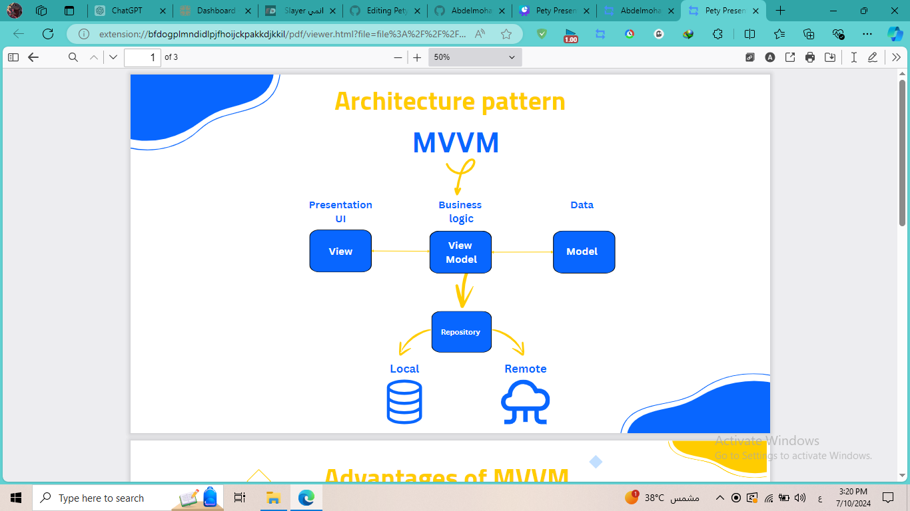
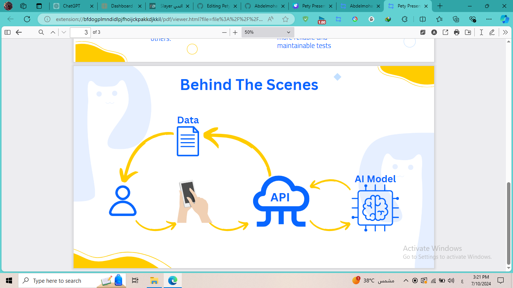

# Pety

Pety is a comprehensive web and mobile application designed to cater to the needs of pet owners, veterinarians, groomers, and pet sitters. As part of my graduation project, I played a pivotal role in developing the mobile application using Flutter technology.

## Features

- **Appointment Booking System**: The application facilitates the seamless booking of appointments with veterinarians, groomers, and pet sitters, providing convenience for pet owners.
- **Specialized Dashboards**: Tailored dashboards are provided for veterinarians, groomers, and pet sitters, enhancing their ability to manage appointments and services efficiently.
- **Community Platform**: Pety incorporates a simplified community platform akin to Facebook, fostering connections and sharing among pet owners and enthusiasts.
- **Integrated Chatbot**: A user-friendly chatbot feature is integrated into the application to provide immediate assistance and address common queries related to pet care.
- **Find Lost Pets**: A feature that allows users to upload pictures of lost pets. Using AI, the app searches a database of missing pets registered by others to help locate and reunite lost pets with their owners.

## Screenshots

    

    

    

  

    

    

    

  

    

## Project structure

  

## Architecture pattern

## How it works

1. **User Interaction**: 
   - The user interacts with the application using their mobile device.

2. **Data Collection**: 
   - Data from the user's interaction is collected and processed.

3. **API Integration**: 
   - The application sends the collected data to the API for further processing.

4. **AI Model Processing**: 
   - The API forwards the data to an AI model.
   - The AI model processes the data to generate relevant results or predictions.

5. **Result Delivery**: 
   - The processed information from the AI model is sent back through the API.
   - The application displays the results to the user, completing the interaction loop.

